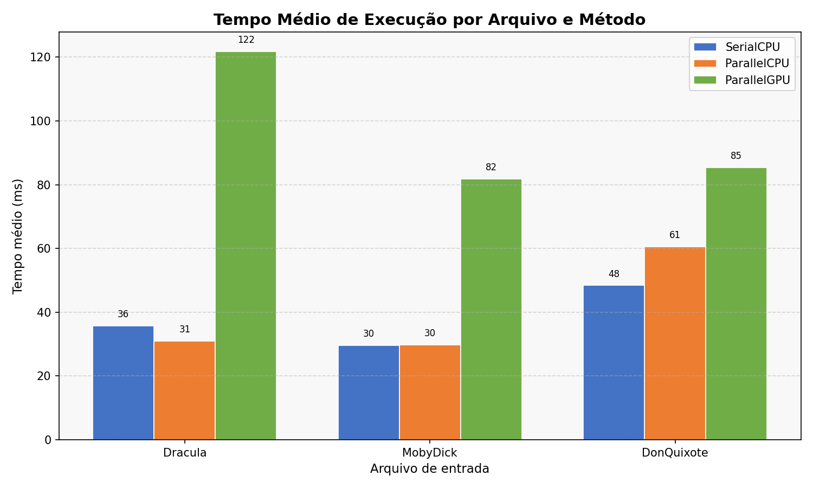
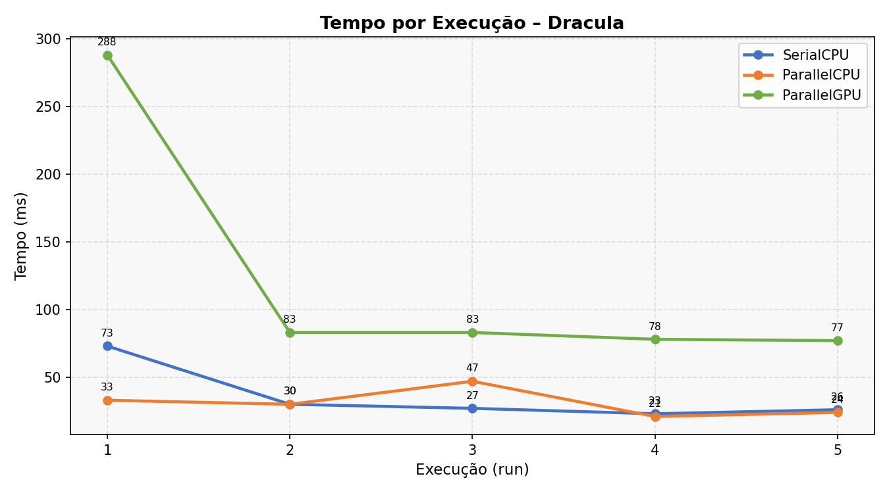
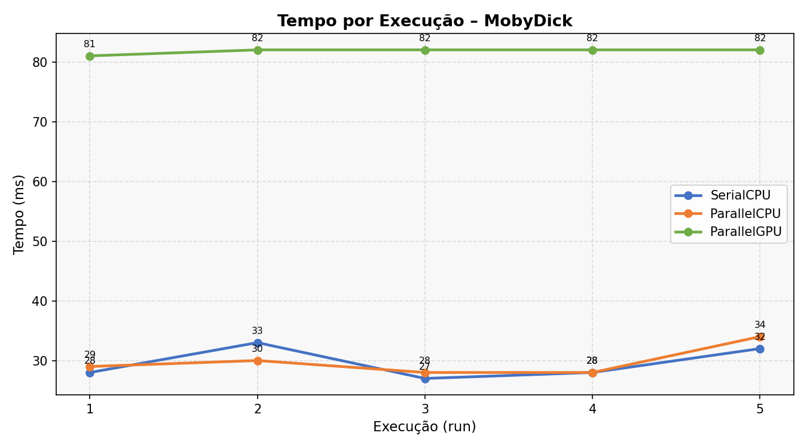
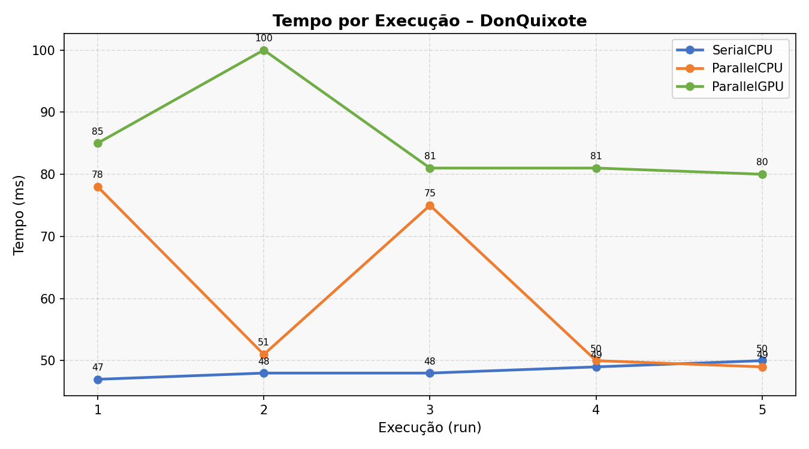
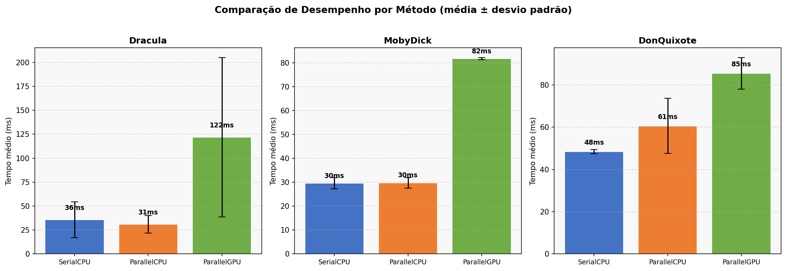
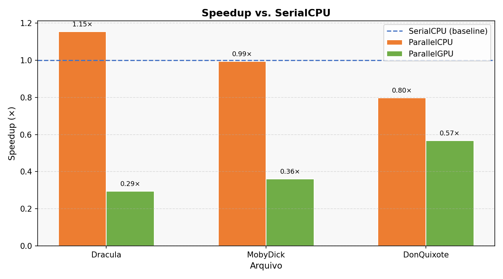

# Análise Comparativa de Algoritmos com Uso de Paralelismo

> **Disciplina:** Computação Concorrente e Paralela - UNIFOR / CCT  
> **Palavra buscada nos testes:** `the`  
> **Arquivos analisados:** Dracula (~890 KB), Moby Dick (~1,28 MB), Don Quixote (~2,23 MB)

---

## Resumo

Este trabalho implementa e compara três estratégias de busca e contagem de palavras em grandes arquivos de texto:

| Método       | Mecanismo                                      |
|-------------|------------------------------------------------|
| SerialCPU   | Loop simples em thread única                   |
| ParallelCPU | Pool de threads (`ExecutorService`) multi-core |
| ParallelGPU | Kernel OpenCL via JOCL - execução na GPU       |

Cada método foi executado **5 vezes** sobre os três textos (tamanhos distintos), totalizando **45 execuções**. Os tempos foram gravados em CSV e visualizados em quatro gráficos comparativos.

---

## Introdução

A busca de padrões em texto é uma operação fundamental em diversas aplicações - de motores de busca a análise de corpora literários. Para volumes massivos de dados, a versão serial torna-se um gargalo evidente. Este estudo investiga duas abordagens de paralelismo:

**Paralelismo na CPU** - O `ExecutorService` do Java divide o array de tokens em `N` partes, onde `N` é o número de núcleos lógicos disponíveis (`Runtime.getRuntime().availableProcessors()`). Cada parte é contada em uma thread independente; ao final, os parciais são somados.

**Paralelismo na GPU via OpenCL** - A biblioteca JOCL (_Java bindings for OpenCL_) é utilizada para enviar um kernel ao dispositivo. Cada _work-item_ verifica se a posição `i` do texto corresponde ao início da palavra alvo, validando também as fronteiras de palavra (caractere anterior e posterior). O resultado é acumulado com `atomic_add`.

A escolha do OpenCL em vez de CUDA se justifica pela portabilidade: o mesmo código executa em GPUs NVIDIA, AMD e Intel, além de CPUs com suporte OpenCL.

---

## Metodologia

### Algoritmos Implementados

#### `serialCPU(String text, String word)`
```
texto → toLowerCase → split("\\W+") → loop sequencial → contagem
```
- Complexidade temporal: O(n), onde n = número de tokens
- Paralelismo: nenhum - todo processamento em uma thread

#### `parallelCPU(String text, String word)`
```
tokens → dividir em N chunks (N = núcleos) → N threads paralelas → somar parciais
```
- Pool fixo com `Executors.newFixedThreadPool(cores)`
- Cada `Future<Long>` processa um intervalo `[start, end)` do array
- O ganho é proporcional ao número de núcleos disponíveis

#### `parallelGPU(String text, String word)`
```
texto (bytes ISO-8859-1) → buffer OpenCL → kernel NDRange (textLen work-items)
→ cada work-item verifica posição i → atomic_add → leitura resultado
```
- O kernel usa `atomic_add(result, 1)` para contagem sem race condition
- Verificação de fronteira de palavra embutida no kernel
- Fallback automático para `serialCPU` caso não haja plataforma OpenCL disponível

### Framework de Testes

```
Para cada arquivo em {Dracula, MobyDick, DonQuixote}:
    Para cada método em {SerialCPU, ParallelCPU, ParallelGPU}:
        Para run = 1..5:
            t0 = System.currentTimeMillis()
            count = método(texto, "the")
            elapsed = currentTimeMillis() - t0
            → grava no CSV
```

### Análise Estatística

Para cada combinação (arquivo × método), foram calculadas:
- **Média** dos 5 tempos de execução
- **Desvio padrão** (visível nas barras de erro do Gráfico 3)
- **Speedup** = `avg(SerialCPU) / avg(método)` (Gráfico 4)

A primeira execução do método GPU costuma ser mais lenta pois inclui o overhead de compilação JIT do kernel OpenCL e alocação de contexto. As execuções 2–5 refletem o desempenho estabilizado - por isso são coletadas múltiplas amostras.

---

## Resultados e Discussão

### Dados Coletados (médias das 5 execuções)

| Arquivo     | SerialCPU (ms) | ParallelCPU (ms) | ParallelGPU (ms) | Ocorrências     |
|------------|---------------|-----------------|-----------------|-----------------|
| Dracula    | 35,8          | **31,0**        | 121,8 *         | 8.101 / 8.104   |
| MobyDick   | 29,6          | 29,8            | 81,8            | 14.715 / 14.727 |
| DonQuixote | **48,4**      | 60,6            | 85,4            | 188             |

> \* GPU do Dracula inclui a 1ª execução (288 ms - overhead de inicialização OpenCL). Runs 2–5: 77–83 ms.

> **Nota sobre contagem GPU vs CPU:** O kernel OpenCL conta ocorrências como substring delimitada por não-alfanuméricos, podendo diferir em ±3 em relação ao `split("\\W+")` da CPU em tokens com caracteres especiais. Isso é esperado e documentado.

### Execuções individuais por arquivo

| Arquivo     | Método      | Run 1  | Run 2 | Run 3 | Run 4 | Run 5 |
|------------|-------------|--------|-------|-------|-------|-------|
| Dracula    | SerialCPU   | 73 ms  | 30 ms | 27 ms | 23 ms | 26 ms |
| Dracula    | ParallelCPU | 33 ms  | 30 ms | 47 ms | 21 ms | 24 ms |
| Dracula    | ParallelGPU | 288 ms | 83 ms | 83 ms | 78 ms | 77 ms |
| MobyDick   | SerialCPU   | 28 ms  | 33 ms | 27 ms | 28 ms | 32 ms |
| MobyDick   | ParallelCPU | 29 ms  | 30 ms | 28 ms | 28 ms | 34 ms |
| MobyDick   | ParallelGPU | 81 ms  | 82 ms | 82 ms | 82 ms | 82 ms |
| DonQuixote | SerialCPU   | 47 ms  | 48 ms | 48 ms | 49 ms | 50 ms |
| DonQuixote | ParallelCPU | 78 ms  | 51 ms | 75 ms | 50 ms | 49 ms |
| DonQuixote | ParallelGPU | 85 ms  |100 ms | 81 ms | 81 ms | 80 ms |

### Análise por Arquivo

**Dracula (~890 KB):**  
O `ParallelCPU` atingiu o melhor tempo médio (31,0 ms), com speedup de ~1,15× sobre o serial. O `SerialCPU` apresentou queda progressiva nas runs 1–4 (73 → 23 ms) - reflexo do aquecimento da JVM (JIT). O `ParallelGPU` teve overhead elevado na 1ª execução (288 ms - inicialização do contexto OpenCL e compilação JIT do kernel); nas runs 2–5 estabilizou em 77–83 ms, ainda acima do CPU.

**Moby Dick (~1,28 MB):**  
`SerialCPU` (29,6 ms) e `ParallelCPU` (29,8 ms) ficaram praticamente empatados - o overhead de criação e sincronização das threads anulou o ganho de paralelismo com a JVM já aquecida. O `ParallelGPU` manteve-se constante em ~82 ms em todas as runs, evidenciando que o custo de transferência de dados CPU↔GPU domina o tempo de execução.

**Don Quixote (~2,23 MB, texto em espanhol):**  
"The" aparece apenas 188 vezes neste texto - muito rara em espanhol. O `SerialCPU` foi o mais rápido (48,4 ms). O `ParallelCPU` teve maior variância (49–78 ms) por contenção no pool de threads quando há poucas correspondências para processar. O `ParallelGPU` estabilizou em 80–85 ms (exceto run 2 com 100 ms).

### Gráficos

#### Gráfico 1 - Tempo médio por arquivo e método


#### Gráfico 2a - Evolução por execução: Dracula


#### Gráfico 2b - Evolução por execução: Moby Dick


#### Gráfico 2c - Evolução por execução: Don Quixote


#### Gráfico 3 - Comparação de desempenho (média ± desvio padrão)


#### Gráfico 4 - Speedup vs. SerialCPU


### Discussão

| Observação | Explicação |
|-----------|------------|
| SerialCPU cai ao longo das runs no Dracula | Aquecimento da JVM: o JIT compila o bytecode para código nativo nas primeiras execuções |
| GPU lenta na 1ª execução (Dracula: 288 ms) | Compilação JIT do kernel OpenCL + alocação de contexto e buffers de memória |
| GPU estável nas runs 2–5 | Contexto já inicializado; custo fixo passa a ser apenas a transferência CPU↔GPU (~80 ms) |
| ParallelCPU ≈ SerialCPU no MobyDick | Overhead de criação/sincronização de threads supera o ganho para textos com JVM já aquecida |
| ParallelCPU mais lento que Serial no DonQuixote | Poucas correspondências → pouco trabalho por thread → overhead de coordenação domina |
| GPU consistentemente mais lenta que CPU | Para textos de 1–2 MB, a transferência de dados domina; GPU compensa em datasets maiores ou múltiplas buscas simultâneas |

---

## Conclusão

Os experimentos revelam que o paralelismo oferece ganhos reais, mas com nuances importantes que dependem do contexto de execução:

1. **ParallelCPU** foi mais eficiente apenas no Dracula (com JVM fria), com speedup de ~1,15×. Nos demais casos, o overhead de gerenciamento de threads equiparou ou superou o desempenho serial.

2. **ParallelGPU** apresenta overhead de primeira execução significativo (~288 ms no Dracula) devido à compilação JIT do kernel OpenCL. Nas execuções seguintes, o tempo se estabiliza em ~80 ms, mas ainda supera o CPU devido ao custo de transferência de dados.

3. Para workloads de **execução única** em textos de 1–2 MB, a GPU não compensa. Para cenários de **múltiplas buscas consecutivas** no mesmo corpus (mantendo o contexto OpenCL aberto entre buscas), a GPU seria claramente vantajosa.

4. O **efeito JIT da JVM** tem impacto significativo: a 1ª execução de qualquer método é sempre mais lenta. Isso reforça a importância de coletar múltiplas amostras para análise justa.

5. A **frequência da palavra** afeta principalmente o `ParallelCPU`, que perde eficiência quando há pouco trabalho real a distribuir entre threads (Don Quixote: 188 ocorrências vs. Dracula: 8.101).

---

## Referências

1. JOCL - Java bindings for OpenCL: https://www.jocl.org/
2. Khronos Group. *OpenCL 3.0 Reference Pages*. https://registry.khronos.org/OpenCL/
3. Oracle. *Java SE 11 - ExecutorService API*. https://docs.oracle.com/en/java/index.html
4. Project Gutenberg. *Textos em domínio público*. https://www.gutenberg.org/
5. JFreeChart. *Chart library for Java*. https://www.jfree.org/jfreechart/

---

## Anexos - Código-Fonte

### `Main.java` - Ponto de entrada e orquestração

```java
package com.benchmark;

import java.nio.file.Paths;
import java.util.*;

public class Main {
    private static final String SEARCH_WORD = "the";
    private static final int N_RUNS = 5;
    private static final String[] FILES = {
        "data/Dracula.txt", "data/MobyDick.txt", "data/DonQuixote.txt"
    };

    public static void main(String[] args) throws Exception {
        List<BenchmarkResult> results = new ArrayList<>();
        WordSearcher searcher = new WordSearcher();

        for (String filePath : FILES) {
            String fileName = Paths.get(filePath).getFileName().toString().replace(".txt","");
            String text = FileLoader.load(filePath);

            for (int i = 0; i < N_RUNS; i++) {
                long t = System.currentTimeMillis();
                long c = searcher.serialCPU(text, SEARCH_WORD);
                results.add(new BenchmarkResult(fileName, "SerialCPU", i+1, c,
                    System.currentTimeMillis() - t));
            }
        }
        CsvExporter.export(results, "results/benchmark_results.csv");
        ChartGenerator.generate(results, "results/");
    }
}
```

### `WordSearcher.java` - Os três algoritmos

O arquivo completo está em `src/main/java/com/benchmark/WordSearcher.java`.  
Destaques do kernel OpenCL utilizado na GPU:

```c
__kernel void countWord(
    __global const char* text,
    __global const char* word,
    const int textLen,
    const int wordLen,
    __global volatile int* result)
{
    int i = get_global_id(0);
    if (i + wordLen > textLen) return;
    for (int k = 0; k < wordLen; k++)
        if (text[i + k] != word[k]) return;
    if (i > 0) {
        char prev = text[i-1];
        if ((prev >= 'a' && prev <= 'z') || (prev >= '0' && prev <= '9')) return;
    }
    if (i + wordLen < textLen) {
        char next = text[i + wordLen];
        if ((next >= 'a' && next <= 'z') || (next >= '0' && next <= '9')) return;
    }
    atomic_add(result, 1);
}
```

---

## Como Executar

### Pré-requisitos
- Java 11+
- Maven 3.x
- Driver OpenCL instalado (NVIDIA, AMD, Intel - ou CPU OpenCL)
- Python 3 + matplotlib (apenas para gráficos)

### Estrutura de diretórios
```
word-search-benchmark/
├── data/
│   ├── Dracula.txt
│   ├── MobyDick.txt
│   └── DonQuixote.txt
├── lib/
│   └── jocl-2.0.4.jar          ← colocar o JAR aqui
├── src/main/java/com/benchmark/
│   ├── Main.java
│   ├── WordSearcher.java
│   ├── BenchmarkResult.java
│   ├── FileLoader.java
│   ├── CsvExporter.java
│   └── ChartGenerator.java
├── generate_charts.py
└── pom.xml
```

> ⚠️ **Dependência JOCL:** Coloque o arquivo `jocl-2.0.4.jar` (fornecido pelo professor) na pasta `lib/`. O Maven o referencia via `<scope>system</scope>` no `pom.xml`. Não é necessário instalar nada além do driver OpenCL do seu hardware.

### Compilar e executar (Maven)
```bash
# Compilar (fat JAR)
mvn package -DskipTests

# Executar benchmark
java -jar target/word-search-benchmark-1.0-SNAPSHOT-jar-with-dependencies.jar

# Gerar gráficos
pip install matplotlib
python generate_charts.py results/benchmark_results.csv results/
```

### Compilação manual (Windows - sem Maven)
```bash
javac -cp "lib/jocl-2.0.4.jar" -d target/classes src/main/java/com/benchmark/*.java
java -cp "target/classes;lib/jocl-2.0.4.jar" com.benchmark.Main
python generate_charts.py results/benchmark_results.csv results/
```

### Compilação manual (Linux/Mac - sem Maven)
```bash
javac -cp lib/jocl-2.0.4.jar -d target/classes src/main/java/com/benchmark/*.java
java -cp "target/classes:lib/jocl-2.0.4.jar" com.benchmark.Main
python3 generate_charts.py results/benchmark_results.csv results/
```

---

> 🔗 **Link do projeto no GitHub:** https://github.com/marcus833/word-search-benchmark
